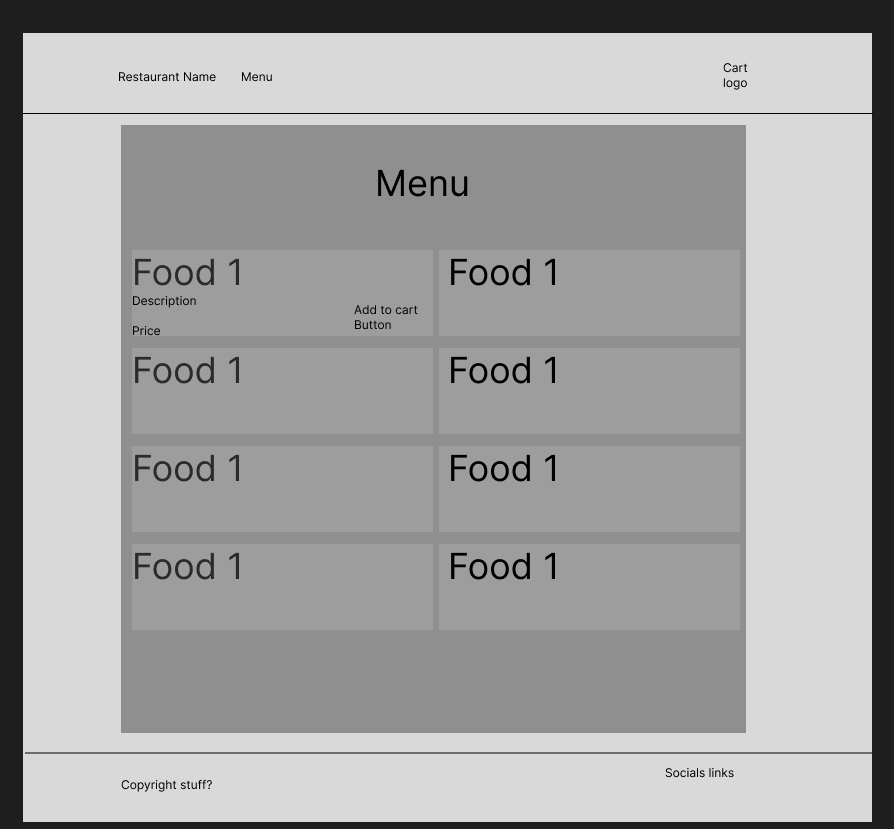

## Questions

 - should state change whole page or use routes?

## HTML/CSS

 - React Component Hierarchy
 - Index.js  
 -- App.js  
 --- MenuPage.js  
 --- LandPage.js  
 ---- Nav.js  
 ---- Footer.js  
 ---- Header.js(same as nav??)  

 - MenuItem

## Variables

 - STATE
 - menuItems [] (what gets pulled in from API)
 - page “breakfast”/”lunch”/”dinner”

## Functions

 - APIcall() (in UseEffect, so automatically calls API after page render)
 - handleNavigate() - change the page or the filter of the items shown on the screen
 - menuFilter(foodType) - change what food is displayed based on filter
Procedures

## User Journey

 - Come onto site
 - Landing page renders
 - Landing page contains most requested info (Hours, Contact info)
 - MUST be able to view menu
 - Click button to view menu
 - Menu renders all options 
 - MUST be able to Click buttons to be able filter what type of menu item i want to see
 - Items SHOULD tell me description of food and COULD have image of dishes
 - Items MUST contain Price and COULD Add to cart button
 - COULD have cart to let me view whats been added and total up the prices

 

	

